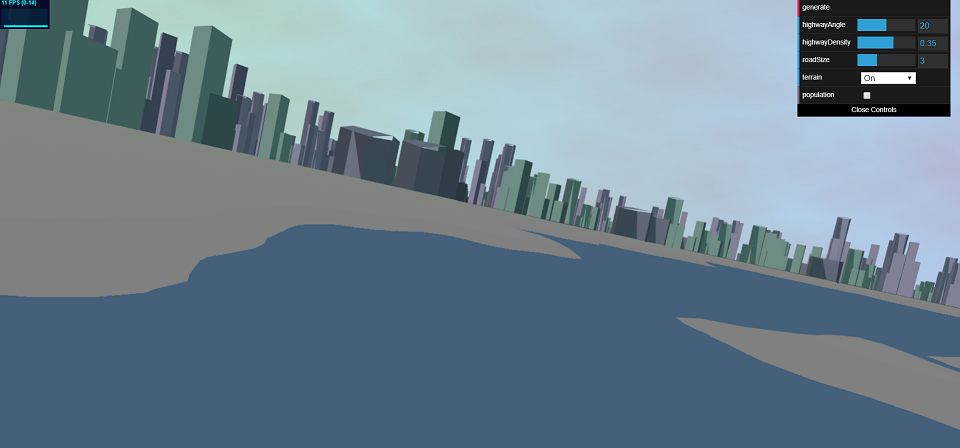
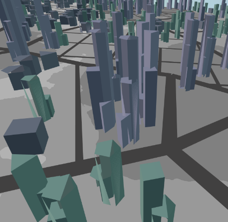

# City Generation

Clemen Deng (PennKey: clemen)

This project is created using the methods listed in this [paper](proceduralCityGeneration.pdf) and [this one](procedural_infinite_cities.pdf). Viewing this project requires a WebGL capable browser. All content is original.

[WebGL link](https://clemendeng.github.io/hw05-road-generation/)

## Features

This project implemented the road generation part of [Procedural Modeling of Cities](proceduralCityGeneration.pdf), and then created buildings using the methods in [Procedural Infinite Cities](procedural_infinite_cities.pdf).

#### 3D Model of Terrain
The terrain and roads from the road generation project now have been implemented in 3D. The terrain slightly slopes down into the water, shown in the following image.

#### Building Generation
This project generates buildings by rasterizing the roads to designate areas where buildings cannot be placed, and then scattering points across the terrain to determine building placement. Buildings extrude downward from a certain height, adding additional geometry to lower levels. 

There are three types of buildings: residential shorter buildings, medium buildings, and skyscrapers. These are placed in areas of low, medium and high population, respectively.

These features can be seen here:

#### Visual Elements
The city is lit with 3 point lighting. The sky is textured using a fbm worley noise function.