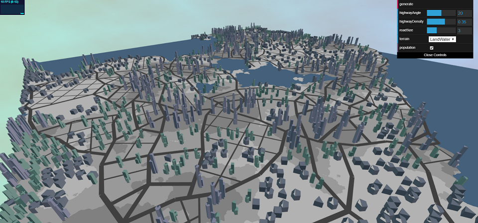
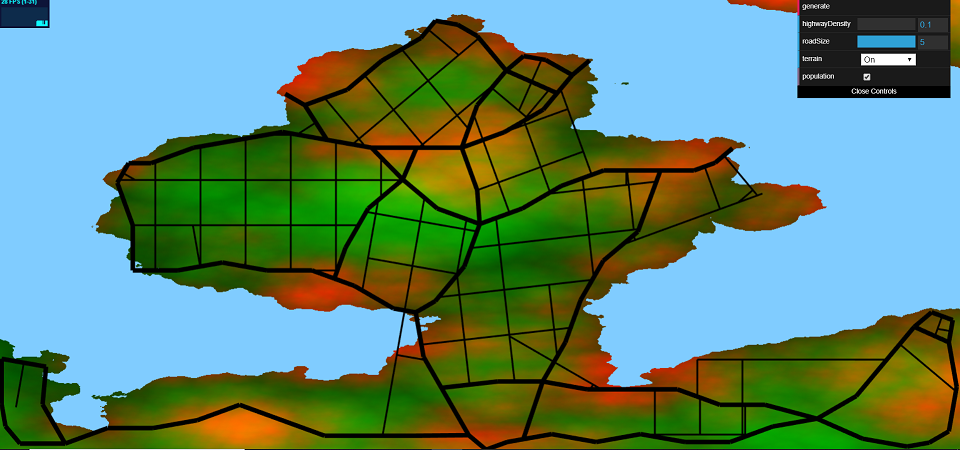
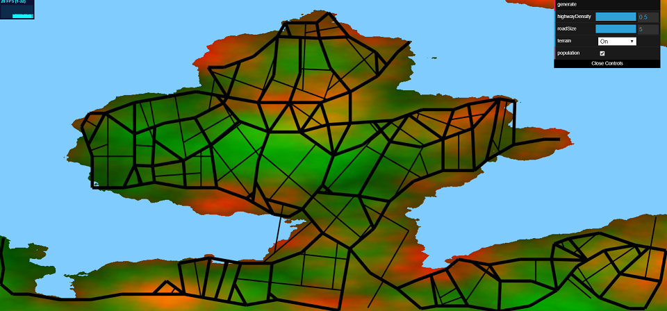
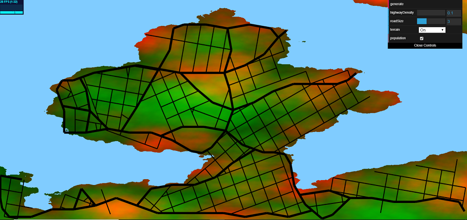

# Roads????????

Clemen Deng (PennKey: clemen)

**Note: Road generation takes some time, please give it at least a minute to generate**

This project is created using the methods listed in this [paper](proceduralCityGeneration.pdf). Viewing this project requires a WebGL capable browser. All content is original.

[WebGL link](https://clemendeng.github.io/hw05-road-generation/)

## Features

This project was an implementation of the road generation part of [Procedural Modeling of Cities](proceduralCityGeneration.pdf).

#### Map Features
A 2D map is generated from Fractal Brownian Motion with Worley noise as a basis. Terrain elevation as well as population density are generated. Terrain below a certain threshold is treated as water. The user can choose which of these attributes they want to see, and they also have an option so see the terrain as just land/water.

#### City Generation
This project uses 2D grids, turtles, and the methods listed in the paper above to generate a city. Highways are generated first, which go towards higher population density areas and curve around water. Highways can also cross water under a certain distance. Highways branch with a probability that can be modified in the GUI. Roads follow a different structure: a grid pattern.

#### GUI Elements
In addition to the map options at the user's disposal, they also have city attributes they can modify: maximum highway angle, highway density and road size. Cities with smaller road size take longer to generate. The user is also given a button to generate the new city after tuning these parameters. Since city generation is random, pressing the button with the same parameters will generate a different city.

High/Low highway density:

 

Low/High road size:

 